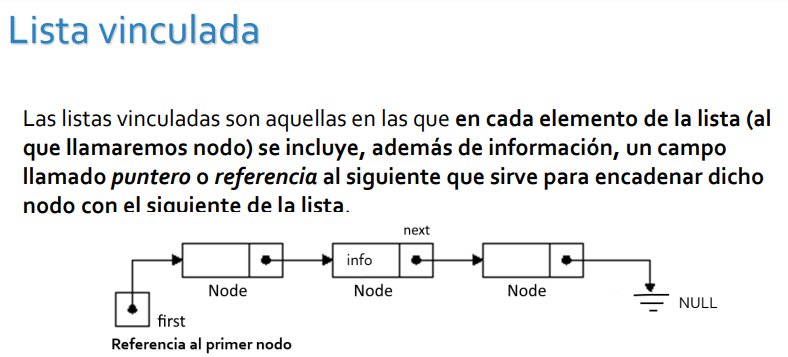

# Trabajo práctico N° 1 - Estructuras de datos
## Ejercicio 1
Implemente los métodos indicados del esqueleto de Lista desarrollado en Teoría (
void insertFront(T), T extractFront(), boolean isEmpty(), int size(),
String toString). Agregar también el método: T get(index).

## Ejercicio 2
Considerando la implementación de la lista vinculada realizada en el ejercicio anterior, comparar la
complejidad computacional contra un array en las siguientes operaciones:
1. Insertar al principio.
2. Buscar un elemento en una posición.
3. Determinar la cantidad de elementos.
4. Borrar un elemento de una posición determinada.

## Ejercicio 3
   A la implementación de la clase Lista realizada en el ejercicio 1, agregue un método
   int indexOf(T), que reciba un elemento y retorne el índice donde está almacenado ese
   elemento, o -1 si el elemento no existe en la lista.
## Ejercicio 4
   A partir de la clase Lista implementada en el ejercicio 1, implemente el patrón
   iterator-iterable, para que la lista sea iterable. ¿Existe alguna ventaja computacional a la hora
   de recorrer la lista de principio a fin si se cuenta con un iterador? 
## Ejercicio 5
   Escriba un procedimiento que dadas dos listas construya otra con los elementos comunes,
   suponiendo que: a) Las listas están desordenadas y la lista resultante debe quedar ordenada. b)
   Las listas están ordenadas y la lista resultante debe mantenerse ordenada.
## Ejercicio 6
   Escriba una función que dadas dos listas construya otra con los elementos que están en la
   primera pero no en la segunda.
## Ejercicio 7
   Considerando la implementación de Lista del ejercicio 1, realice una Lista doblemente vinculada.
   ¿Podemos ahora revisar la implementación inicial de nuestra lista para extender su funcionalidad
   y/o bajar la complejidad de los métodos ya implementados?